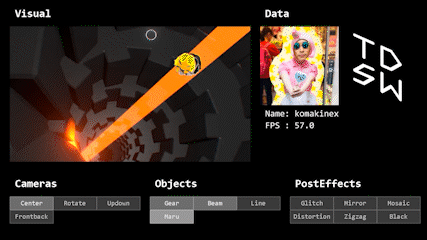

# 20220515_komakinexVJ-Class
TDSWワークショップのサンプルファイル 
Here are sample files from this TDSW workshop.  
https://tdsw20220515.peatix.com/ 
 
資料は`TouchDesigner_Vol.057_komakinexs_vjing_class.pdf`です。 
Workshop documents are in `TouchDesigner_Vol.057_komakinexs_vjing_class.pdf` 
 
ワークショップのアーカイブはこちらから 
You can see the archive of this workshop here. 
https://youtube.com/playlist?list=PLBBXvPY2hFT3oXhoCzyG-N33tBV8tF__H 
 
## 2022.7.5追記
2022.25370バージョンでエラーが起きていた、各toeファイルのCamerasの中にある`CAM_TO_MAT`を修正しました。 
Added on July 5, 2022 
Fixed `CAM_TO_MAT` in Cameras of each toe file, which was causing an error in 2022.25370 version. 

***
 

## ファイルの説明 
### toe/class_sample.toe
ワークショップで作るファイルの完成形です。 
This is a complete file to be made in this workshop. 
### toe/komakinexVJ.toe
komakinexがMUTEK.JP 2021で使用したVJシステムを簡略化したものです。 
This is a simplified version of the VJ system used by komakinex for MUTEK.JP 2021. 

### sound/part04.mp3
Masayuki AzegamiのアルバムAtmospheric Entryに収録されているEncounterという曲です 
This is the song "Encounter" from Masayuki Azegami's album "Atmospheric Entry". 
https://masayuki-azegami.bandcamp.com/album/atmospheric-entry 
 
***
 
質問があるときはDMなどで！ 
Let me know if you have any questions. 
 
komakinex 

Twitter: https://twitter.com/komakinex 
Instagram: https://www.instagram.com/komakinex/ 
YouTube: https://www.youtube.com/channel/UCSYJcxgq-TPtEKFoUu5xsXA
